# Pulse - AI Priority Engine

An engineering metrics dashboard with AI-powered priority recommendations.

## Architecture

Containerized full-stack application:

- **Backend**: FastAPI with async PostgreSQL and OpenAI integration
- **Frontend**: Next.js 15 with TypeScript and TailwindCSS
- **Infrastructure**: Podman/Docker Compose with multi-stage builds
- **Database**: PostgreSQL with migrations and connection pooling
- **Development**: Task runner with `just`, containerized development environment

## 🏗️ System Design

```mermaid
graph TB
    User[👤 User] --> Web[🌐 Next.js Frontend]
    Web --> API[🚀 FastAPI Backend]
    API --> DB[(🗄️ PostgreSQL)]
    API --> Redis[(💾 Redis Cache)]
    API --> OpenAI[🤖 OpenAI API]
    API --> Linear[📊 Linear API]
    API --> GitHub[🐙 GitHub API]

    subgraph "Context Engine"
        CB[Context Builder]
        PE[Priority Engine]
        CB --> PE
    end

    API --> CB
    PE --> AI[AI Reasoning Chain]

    subgraph "Monitoring Stack"
        Prometheus[📈 Prometheus]
        Grafana[📊 Grafana]
        Loki[📝 Loki Logs]
    end
```



## Features

### AI Priority Engine
- Context analysis from Linear and GitHub activity
- Multi-factor scoring algorithm for task prioritization
- OpenAI-powered reasoning (optional)
- Basic feedback collection for recommendations

### Data Sources
- **GitHub**: Pull requests, commits, issue activity
- **Linear**: Issue tracking and state changes
- **Metrics**: 48-hour rolling window analytics

## Setup

### Prerequisites
- Podman or Docker
- just task runner (`brew install just` or `cargo install just`)

### Quick Start

1. **Clone and setup**:
   ```bash
   git clone <repository>
   cd pulse
   cp .env.example .env
   ```

2. **Start development environment**:
   ```bash
   just dev
   ```

3. **Run database migrations**:
   ```bash
   just db-migrate
   ```

4. **Access the application**:
   - Frontend: http://localhost:3000
   - API: http://localhost:8000
   - API Docs: http://localhost:8000/docs

### Available Commands
```bash
just setup     # Build containers
just dev       # Start development stack
just stop      # Stop all services
just logs      # View all logs
just db-shell  # Database shell
just clean     # Clean up containers
```
- **Monitoring**: Observability with metrics, logs, and distributed tracing

## 🛠️ Tech Stack

### Backend
- **FastAPI** - Modern, async Python web framework
- **PostgreSQL** - Robust relational database with JSONB support
- **Redis** - Caching and session management
- **OpenAI API** - GPT-4 for intelligent reasoning
- **Linear/GitHub APIs** - External data ingestion

### Frontend
- **Next.js 14** - React framework with App Router
- **TypeScript** - Type-safe development
- **TailwindCSS** - Utility-first styling
- **React Query** - Server state management
- **Responsive Design** - Mobile-first approach

### Infrastructure
- **Podman/Docker** - Containerization with security focus
- **Multi-stage builds** - Optimized container images
- **Health checks** - Service reliability monitoring
- **Volume management** - Data persistence and caching

## 🚀 Quick Start

### Prerequisites

Install required tools:
```bash
# macOS
brew install podman podman-compose just

# Verify installation
podman --version
just --version
```

### Development Setup

1. **Clone and setup environment:**
   ```bash
   git clone <repository-url>
   cd pulse
   cp .env.example .env
   # Edit .env with your API keys
   ```

2. **Start development environment:**
   ```bash
   just setup    # Build containers and install dependencies
   just dev      # Start all services
   ```

3. **Access the application:**
   - Frontend: http://localhost:3000
   - API: http://localhost:8000
   - API Docs: http://localhost:8000/docs
   - Health Check: http://localhost:8000/health

### Available Commands

```bash
# Development
just dev              # Start development stack
just dev-detached     # Start detached (background)
just stop             # Stop all services

# Database
just db-migrate       # Apply database migrations
just db-reset         # Reset database (careful!)
just db-shell         # Open database shell

# Testing & Quality
just test             # Run all tests
just lint             # Run linting
just format           # Format code
just security         # Security scanning

# Monitoring
just logs [service]   # View logs
just monitor          # System resource monitoring

# Production
just build            # Build production containers
just k8s              # Generate Kubernetes manifests
```

### Shell Access

```bash
just shell api        # API development shell
just shell web        # Web development shell
just api-shell        # Python REPL with context loaded
```

## 📊 API Endpoints

### Priority Engine
- `POST /priority/generate` - Generate AI priority recommendation
- `POST /priority/feedback` - Record recommendation feedback
- `GET /journey/state` - Get user journey progress

### Data Ingestion
- `POST /ingest/run` - Trigger GitHub/Linear data ingestion
- `POST /analyze` - Compute 48h engineering metrics

### Monitoring
- `GET /health` - System health check
- `GET /report/public` - Public metrics report

## 🗄️ Database Schema

### Core Tables
- `events` - Normalized GitHub/Linear activity events
- `metrics_daily` - Computed engineering metrics
- `user_journey` - Journey state and preferences
- `priority_recommendations` - AI recommendations and outcomes
- `feedback` - Learning system feedback

### Key Features
- **JSONB Support**: Flexible metadata storage
- **Unique Constraints**: Idempotent event ingestion
- **Indexes**: Optimized queries for time-series data
- **Migrations**: Version-controlled schema changes

## 🔒 Security

- **Non-root containers**: All services run as unprivileged users
- **Secret management**: Environment-based configuration
- **Read-only containers**: Immutable container filesystems
- **Network isolation**: Separate networks for frontend/backend/monitoring
- **HTTPS ready**: SSL termination and certificate management

## 📈 Monitoring & Observability

### Production Monitoring
- **Prometheus**: Metrics collection and alerting
- **Grafana**: Visualization dashboards
- **Loki**: Centralized log aggregation
- **Health checks**: Service availability monitoring

### Development Monitoring
- **Container stats**: Resource usage monitoring
- **Log streaming**: Real-time log viewing
- **Database monitoring**: Connection pool and query metrics

## 🚀 Production Deployment

### Production Stack
```bash
# Production deployment with monitoring
docker-compose -f docker-compose.prod.yml up -d

# Access monitoring
# Grafana: http://localhost:3001
# Prometheus: http://localhost:9090
```

### Environment Variables
See `.env.example` for comprehensive configuration options including:
- Database credentials
- API keys (GitHub, Linear, OpenAI)
- Security settings
- Monitoring configuration

## 🏛️ Architecture Decisions

### Staff-Level Design Patterns

1. **Context Builder Pattern**: Aggregates data from multiple sources
2. **Strategy Pattern**: Pluggable scoring algorithms
3. **Repository Pattern**: Clean data access layer
4. **Event Sourcing**: Immutable event storage for analysis
5. **CQRS**: Separate read/write models for optimization

### Technology Choices

- **FastAPI over Flask/Django**: Modern async support, automatic OpenAPI generation
- **PostgreSQL over NoSQL**: Strong consistency for financial/metrics data
- **Podman over Docker**: Rootless containers, better security model
- **Just over Make**: Modern task runner with better ergonomics
- **Multi-stage builds**: Separate dev/test/prod optimizations

## 🧪 Testing Strategy

### Backend Testing
- Unit tests with pytest
- Integration tests with test database
- API endpoint testing
- Mock external API calls

### Frontend Testing
- Component testing with React Testing Library
- End-to-end testing with Playwright
- Type checking with TypeScript

### Infrastructure Testing
- Container health checks
- Database migration testing
- Security vulnerability scanning

## 📚 Development Philosophy

This project demonstrates staff engineer capabilities through:

- **System Design**: Complex interactions between multiple services
- **Code Quality**: Comprehensive testing, linting, type safety
- **Developer Experience**: Modern tooling, clear documentation, easy setup
- **Production Readiness**: Monitoring, security, scalability considerations
- **Maintainability**: Clean architecture, separation of concerns, SOLID principles

---

**Built with ❤️ as a Portfolio Project**

*Demonstrating modern full-stack development, AI integration, and production-ready infrastructure.*
